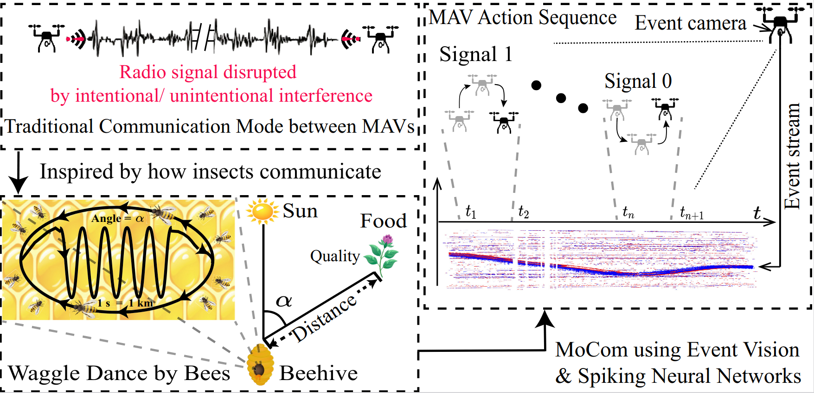
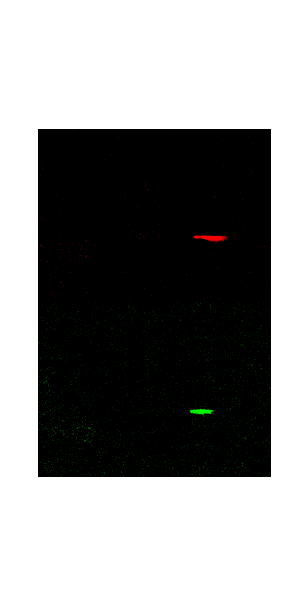
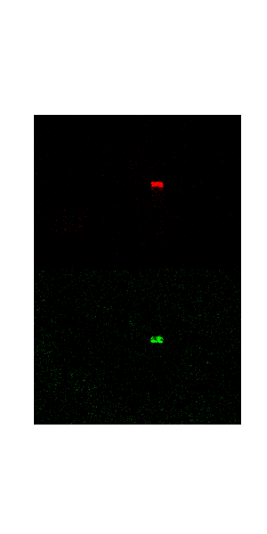
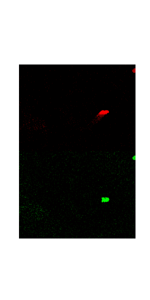
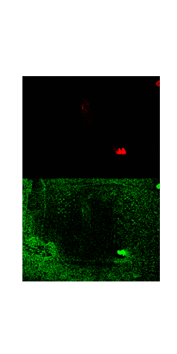

# MoCom  
**Motion-based Inter-MAV Visual Communication Using Event Vision and Spiking Neural Networks**

## Authors  
**Nengbo Zhang**, **Hann Woei Ho\***, **Ye Zhou**

---

## 🔍 Research Motivation



> **Figure:** Research motivation of MoCom.  
> Instead of relying on conventional radio-frequency (RF) communication, MAVs encode information through deliberate motion patterns. These motion-based signals are passively observed by vision sensors and decoded as communication symbols.

### Why MoCom?

Reliable communication in Micro Air Vehicle (MAV) swarms remains a fundamental challenge, especially in environments where:

- RF spectrum is congested or restricted  
- Communication is vulnerable to jamming or interception  
- Power budgets are extremely limited  

Inspired by the **waggle dance of honeybees**, which conveys rich spatial information without sound or physical contact, we explore a **motion-based visual communication paradigm** for MAV swarms.

The key idea is to **treat MAV motion itself as a communication carrier**, rather than as a by-product of control or navigation.

---

## 🧠 Introduction

This project proposes **MoCom**, a motion-based inter-MAV visual communication framework built on **event cameras** and **Spiking Neural Networks (SNNs)**.

In MoCom:

- A transmitting MAV deliberately performs predefined **motion primitives**
- A receiving MAV passively observes these motions using an **event camera**
- Motion sequences are **parsed, segmented, and decoded** into symbolic messages

### Motion Codebook

We define a compact visual codebook composed of **four motion primitives**:

| Motion Primitive | Semantic Meaning |
|------------------|------------------|
| Vertical (Up / Down) | Start symbol |
| Horizontal (Left / Right) | End symbol |
| Left → Up → Right | Binary `1` |
| Left → Down → Right | Binary `0` |


|  |  |  |  |


### Decoding Pipeline

The decoding process consists of three stages:

1. **Event-based Motion Segmentation**  
   Continuous event streams are parsed into discrete motion segments using an event-frame-based segmentation model.

2. **Lightweight SNN-based Motion Recognition**  
   Each segmented motion primitive is classified using a lightweight Spiking Neural Network optimized for low power consumption.

3. **Symbolic Decoding**  
   Segmentation and recognition results are combined to recover the transmitted message sequence.

Experimental results demonstrate that MoCom enables **robust, low-latency, and energy-efficient communication**, making it a promising alternative to RF-based links in constrained or adversarial environments.

---

## 📦 Code Status

> ⚠️ **Important Notice**

This repository contains the **first public version** of the MoCom codebase.

- The current implementation focuses on **core algorithm validation**
- Code structure and documentation are still being **actively refined**
- Additional modules, experiments, and datasets will be released progressively

---

## 🛠️ To-Do List (Ongoing Development)

### Core Components
- [x] Event-based motion frame generation  
- [x] Motion segmentation using temporal event statistics  
- [x] Lightweight SNN for motion primitive recognition  
- [x] End-to-end motion decoding pipeline  

### Planned Updates
- [x] Code refactoring and modularization  
- [x] Detailed configuration files and parameter explanations  
- [x] Training and evaluation scripts for SNN models  
- [x] Visualization tools for event streams and segmentation results  
- [x] Extended experiments under varying lighting and background conditions  
- [ ] Dataset organization and release  
- [x] Documentation and usage examples  
- [x] Benchmark comparison with RF-based and RGB-based methods  

---

## Hardware and Experimental Setup


**Figure:** Hardware platform and experimental setup used in MoCom.  
The transmitting MAV performs predefined motion primitives, while the receiving MAV observes the motion using an event camera. The captured event stream is processed on an embedded computing platform for motion segmentation and decoding.

### Hardware Platform

- **Micro Air Vehicle (MAV):** Quadrotor platform with programmable flight control
- **Vision Sensor:** Event-based camera for asynchronous motion perception
- **Onboard Computing:** Embedded computing platform for real-time event processing and decoding
- **Communication Mode:** Motion-based visual signaling (no RF data transmission)


- [Crazyflie Bolt 1.1 Flight Controller](https://www.bitcraze.io/products/crazyflie-bolt-1-1/)
  
- [SpikeJelly](https://www.jevoisinc.com/products/jevois-a33-smart-machine-vision-camera?variant=36249051018)
  
- [Lighthouse](https://www.bitcraze.io/documentation/system/positioning/loco-positioning-system/)
  
- [HTC sensor](https://www.bitcraze.io/products/flow-deck-v2/)

### Experimental Protocol

- MAV motion primitives are executed in a controlled indoor environment
- Continuous event streams are recorded during motion execution
- Event frames are generated and segmented using temporal statistics
- Each motion segment is classified by a lightweight Spiking Neural Network
- Decoded symbol sequences are compared with ground-truth messages

## 📖 Citation

If you use this code or dataset in an academic context, please cite our work:

```text
Nengbo Zhang, Hann Woei Ho*, Ye Zhou,
"MoCom: Motion-based Inter-MAV Visual Communication Using Event Vision and Spiking Neural Networks",
submitted to IEEE Transactions on Robotics.
